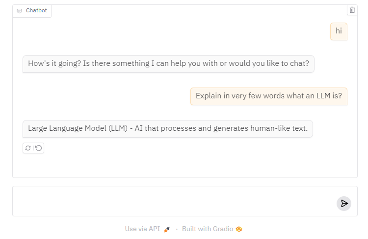
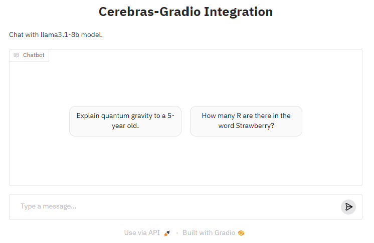

# `cerebras_gradio`

is a Python package that makes it very easy for developers to create machine learning apps that are powered by Cerebras's Inference API.

# Installation

1. Clone this repo: `git clone git@github.com:gradio-app/cerebras_gradio.git`
2. Navigate into the folder that you cloned this repo into: `cd cerebras_gradio`
3. Install this package: `pip install -e .`

<!-- ```bash
pip install Cerebras-gradio
``` -->

That's it! 

# Basic Usage

Just like if you were to use the `Cerebras` Client, you should first save your Cerebras API token to this environment variable:

```
export CEREBRAS_API_TOKEN=<your token>
```

Then in a Python file, write:

```python
import gradio as gr
import cerebras_gradio

gr.load(
    name='llama3.1-8b',
    src=cerebras_gradio.registry,
).launch()
```

Run the Python file, and you should see a Gradio ChatInterface connected to the model on Cerebras!



# Customization 

Once you can create a Gradio UI from a Cerebras endpoint, you can customize it by setting your own input and output components, or any other arguments to `gr.ChatInterface`. For example, the screenshot below was generated with:

```py
import gradio as gr
import cerebras_gradio

gr.load(
    name='llama3.1-8b',
    src=cerebras_gradio.registry,
    title='Cerebras-Gradio Integration',
    description="Chat with llama3.1-8b model.",
    examples=["Explain quantum gravity to a 5-year old.", "How many R are there in the word Strawberry?"]
).launch()
```


# Composition

Or use your loaded Interface within larger Gradio Web UIs, e.g.

```python
import gradio as gr
import cerebras_gradio

with gr.Blocks() as demo:
    with gr.Tab("8B"):
        gr.load('llama3.1-8b', src=cerebras_gradio.registry)
    with gr.Tab("70B"):
        gr.load('llama3.1-70b', src=cerebras_gradio.registry)

demo.launch()
```

# Under the Hood

The `cerebras-gradio` Python library has two dependencies: `cerebras_cloud_sdk` and `gradio`. It defines a "registry" function `cerebras_gradio.registry`, which takes in a model name and returns a Gradio app.

# Supported Models in Cerebras API
Currently the available options are: llama3.1-8b, llama3.1-70b

-------

Note: if you are getting a 401 authentication error, then the Cerebras API Client is not able to get the API token from the environment variable. This happened to me as well, in which case save it in your Python session, like this:

```py
import os

os.environ["CEREBRAS_API_TOKEN"] = ...
```
